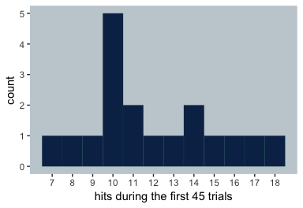
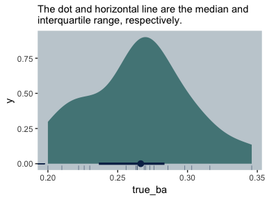
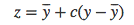
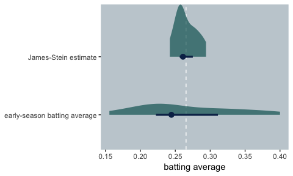
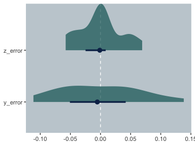
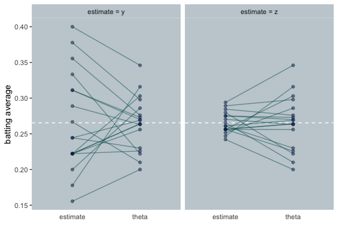
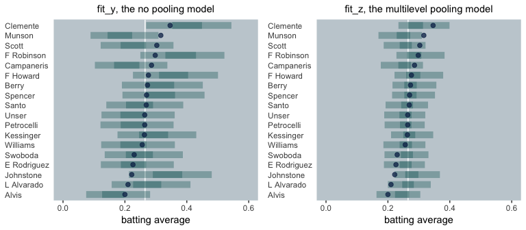
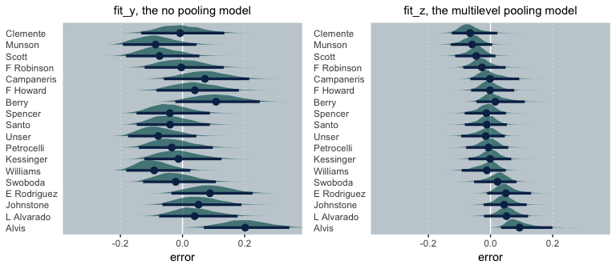

---
output:
  md_document:
    variant: markdown_github
---


# James-Stein and Bayesian partial pooling

## [tl;dr](https://www.urbandictionary.com/define.php?term=tl%3Bdr)

The James-Stein estimator leads to better predictions than simple means. Though I don’t recommend you actually use the James-Stein estimator in applied research, understanding why it works might help clarify why we should [default to multilevel models](http://elevanth.org/blog/2017/08/24/multilevel-regression-as-default/).

## James-Stein can help us understand multilevel models

I recently noticed someone—I wish I could recall who—tweet about Efron and Morris’s classic paper, [*Stein’s Paradox in Statistics*](http://statweb.stanford.edu/~ckirby/brad/other/Article1977.pdf). I was vaguely aware of the paper, but hadn’t taken the chance to read it. The tweet’s author mentioned how good a read it was. Now I’ve looked at it, I concur. I’m not a sports fan, but I really appreciated their primary example using batting averages from baseball players in 1970. It clarified why partial pooling leads to better estimates than taking simple averages. In this project, I’ll walk out their example in R and then link it to contemporary Bayesian multilevel models.

### I assume things.

For this project, I’m presuming you are familiar with linear regression, vaguely familiar with the basic differences between frequentist and Bayesian approaches to fitting regression models, and have heard of multilevel models. All code in is [R](https://www.r-project.org/about.html), with a heavy use of the [tidyverse](https://www.tidyverse.org)—which you might learn a lot about [here](http://r4ds.had.co.nz), especially [chapter 5](http://r4ds.had.co.nz/transform.html)—, and the [brms package](https://github.com/paul-buerkner/brms).

### Behold the `baseball` data.

First, we'll load the `baseball` data from the example.


```r
library(readxl)
library(tidyverse)

baseball <- read_excel("data/James_Stein_baseball_data.xlsx")

head(baseball)
```

```
## # A tibble: 6 x 4
##   player      hits times_at_bat true_ba
##   <chr>      <dbl>        <dbl>   <dbl>
## 1 Clemente      18           45   0.346
## 2 F Robinson    17           45   0.298
## 3 F Howard      16           45   0.276
## 4 Johnstone     15           45   0.222
## 5 Berry         14           45   0.273
## 6 Spencer       14           45   0.27
```

We have data from 18 players. The main columns are of the number of `hits` for their first 45 `times_at_bat`. I got the `player` through `times_at_bat` values directly from the paper. However, Efron and Morris didn't include the batting averages for the end of the season in the paper. However, I was able to find those values [online](http://statweb.stanford.edu/~ckirby/brad/LSI/chapter1.pdf). They're included in the `true_ba` column.

The color theme for the plots in this project come from [here](https://teamcolorcodes.com/seattle-mariners-color-codes/).


```r
navy_blue <- "#0C2C56"
nw_green  <- "#005C5C"  
silver    <- "#C4CED4"

theme_set(theme_grey() +
            theme(panel.grid = element_blank(),
                  panel.background = element_rect(fill = silver),
                  strip.background = element_rect(fill = silver)))
```

We might use a histogram to get a sense of the `hits`.


```r
baseball %>% 
  ggplot(aes(x = hits)) +
  geom_histogram(color = nw_green,
                 fill  = navy_blue,
                 size  = 1/10, binwidth = 1) +
  scale_x_continuous("hits over the first 45 trials",
                     breaks = 7:18)
```



And this is the distribution of the end-of-the-season batting averages, `true_ba`.


```r
library(tidybayes)

baseball %>% 
  ggplot(aes(x = true_ba, y = 0)) +
  geom_halfeyeh(color = navy_blue,
                fill  = alpha(nw_green, 2/3),
                point_range = median_qi, .width = .5) +
  geom_rug(color = navy_blue,
           size = 1/3, alpha = 1/2) +
  ggtitle(NULL, subtitle = "The dot and horizontal line are the median and\ninterquartile range, respectively.")
```



### James-Stein will help us achieve our goal.

For each of the 18 players in the data, our goal is to the best job possible to use their initial batting average data (i.e., `hits` and `times_at_bat`) to predict their batting averages at the end of the season (i.e., `true_ba`). Before Stein, the conventional reasoning was their initial batting averages (i.e., `hits / times_at_bat`) are the best way to do this. It turns out that would be naïve. To see why, let

* `y` (i.e., $y$) = the batting average for the first 45 times at bat
* `y_bar` (i.e., $\overline{y}$) = the grand mean for the first 45 times at bat
* `c` (i.e., $c$) = shrinking factor
* `z` (i.e., $z$) = James-Stein estimate
* `true_ba` (i.e., `theta`, $\theta$) = the batting average at the end of the season

> The first step in applying stein’s method is to determine the average of the averages. Obviously this grand average, which we give the symbol $\overline y$, must also lie between 0 and 1. The essential process in Stein’s method is the "shrinking" of all the individual averages toward this grand average. If a player’s hitting record is better than the grand average, then it must be reduced; if he is not hitting as well as the grand average, then his hitting record must be increased. The resulting shrunken value for each player we designate $z$. (p. 119)

As such, the James-Stein estimator is



And in the paper, $c = .212$. Let's get some of those values into the `baseball` data.


```r
(
  baseball <-
  baseball %>% 
  mutate(y     = hits / times_at_bat) %>% 
  mutate(y_bar = mean(y),
         c     = .212) %>% 
  mutate(z     = y_bar + c * (y - y_bar),
         theta = true_ba)
  )
```

```
## # A tibble: 18 x 9
##    player       hits times_at_bat true_ba     y y_bar     c     z theta
##    <chr>       <dbl>        <dbl>   <dbl> <dbl> <dbl> <dbl> <dbl> <dbl>
##  1 Clemente       18           45   0.346 0.4   0.265 0.212 0.294 0.346
##  2 F Robinson     17           45   0.298 0.378 0.265 0.212 0.289 0.298
##  3 F Howard       16           45   0.276 0.356 0.265 0.212 0.285 0.276
##  4 Johnstone      15           45   0.222 0.333 0.265 0.212 0.280 0.222
##  5 Berry          14           45   0.273 0.311 0.265 0.212 0.275 0.273
##  6 Spencer        14           45   0.27  0.311 0.265 0.212 0.275 0.27 
##  7 Kessinger      13           45   0.263 0.289 0.265 0.212 0.270 0.263
##  8 L Alvarado     12           45   0.21  0.267 0.265 0.212 0.266 0.21 
##  9 Santo          11           45   0.269 0.244 0.265 0.212 0.261 0.269
## 10 Swoboda        11           45   0.23  0.244 0.265 0.212 0.261 0.23 
## 11 Unser          10           45   0.264 0.222 0.265 0.212 0.256 0.264
## 12 Williams       10           45   0.256 0.222 0.265 0.212 0.256 0.256
## 13 Scott          10           45   0.303 0.222 0.265 0.212 0.256 0.303
## 14 Petrocelli     10           45   0.264 0.222 0.265 0.212 0.256 0.264
## 15 E Rodriguez    10           45   0.226 0.222 0.265 0.212 0.256 0.226
## 16 Campaneris      9           45   0.286 0.2   0.265 0.212 0.252 0.286
## 17 Munson          8           45   0.316 0.178 0.265 0.212 0.247 0.316
## 18 Alvis           7           45   0.2   0.156 0.265 0.212 0.242 0.2
```

Now we have both $y$ and $z$ in the data, let's compare their distributions.


```r
baseball %>% 
  select(y, z) %>% 
  gather() %>% 
  mutate(label = ifelse(key == "z", 
                        "James-Stein estimate", 
                        "early-season batting average")) %>% 
  
  ggplot(aes(x = value, y = label)) +
  geom_vline(color = "white",
             xintercept = 0.2654321, linetype = 2) +
  geom_halfeyeh(color = navy_blue,
                fill  = alpha(nw_green, 2/3),
                point_range = median_qi, .width = .5) +
  labs(x = "batting average", y = NULL)
```



As implied in the formula, the James-Stein estimates are substantially shrunken towards the grand mean, `y_bar`. To get a sense of which estimate is better, we can subtract the estimate from `theta`, the end of the season batting average.


```r
baseball <-
  baseball %>% 
  mutate(y_error = theta - y,
         z_error = theta - z)
```

Since `y_error` and `y_error` are error distributions, we prefer values to be as close to zero as possible. Let's look at their distributions.


```r
baseball %>% 
  select(y_error:z_error) %>% 
  gather() %>% 
  
  ggplot(aes(x = value, y = key)) +
  geom_vline(xintercept = 0, linetype = 2,
             color = "white") +
  geom_halfeyeh(color = navy_blue,
                fill  = alpha(nw_green, 2/3),
                point_range = median_qi, .width = .5) +
  labs(x = NULL, y = NULL)
```



The James-Stein errors (i.e., `z_error`) are much more concentrated toward zero. In the paper, we read: "One method of evaluating the two estimates is by simple counting their successes and failures. For 16 of the 18 players the James-Stein estimator $z$ is closer than the observed average $y$ to the 'true,' or seasonal, average $\theta$." We can compute that like so:


```r
baseball %>% 
  transmute(closer_to_theta = ifelse(abs(y_error) - abs(z_error) == 0, "equal",
                                     ifelse(abs(y_error) - abs(z_error) > 0, "z", "y"))) %>% 
  group_by(closer_to_theta) %>% 
  count()
```

```
## # A tibble: 2 x 2
## # Groups:   closer_to_theta [2]
##   closer_to_theta     n
##   <chr>           <int>
## 1 y                   2
## 2 z                  16
```

We then read: "The observed averages $y$ have a total squared error of .077, whereas the squared error of the James-Stein estimators is only .022. By this comparison, then, Stein’s method is 3.5 times as accurate."


```r
baseball %>% 
  select(y_error:z_error) %>% 
  gather() %>% 
  group_by(key) %>% 
  summarise(total_squared_error = sum(value * value))
```

```
## # A tibble: 2 x 2
##   key     total_squared_error
##   <chr>                 <dbl>
## 1 y_error              0.0755
## 2 z_error              0.0214
```

We can get the 3.5 value like so:


```r
0.07548795 / 0.02137602
```

```
## [1] 3.531431
```

So it does indeed turn out that shrinking each player’s initial estimate toward the grand mean of those initial estimates does a better job of predicting their end-of-the-season batting averages than using their individual batting averages.

To get a sense of what this looks like, let’s make our own version of the figure on page 121.


```r
baseball %>% 
  select(y, z, theta, player) %>% 
  gather(key, value, -player) %>% 
  mutate(time = ifelse(key == "theta", "theta", "estimate")) %>% 
  bind_rows(
    baseball %>% 
      select(player, theta) %>% 
      rename(value = theta) %>% 
      mutate(key  = "theta", 
             time = "theta")
  ) %>% 
  mutate(facet = rep(c("estimate = y", "estimate = z"), each = n() / 4) %>% rep(., times = 2)) %>% 
  
  ggplot(aes(x = time, y = value, group = player)) +
  geom_hline(yintercept = 0.2654321, linetype = 2,
             color = "white") +
  geom_line(alpha = 1/2,
            color = nw_green) +
  geom_point(alpha = 1/2,
             color = navy_blue) +
  labs(x = NULL,
       y = "batting average") +
  theme(axis.ticks.x = element_blank()) +
  facet_wrap(~facet)
```



The James-Stein estimator works because of its shrinkage. The shrinkage factor is $c$. In the first parts of the paper, Efron and Morris just told us $c = .212$. A little later in the paper, they give the formula for $c$. If you let $k$ be the number of means (i.e., the number of clusters), then 

<center>


</center>

The difficulty of that formula is we don't know the value for $\sigma^2$. It's not the simple variance of $y$ (i.e., `var(y)`). An [answer to this stackexchange question](https://stats.stackexchange.com/questions/5727/james-stein-estimator-how-did-efron-and-morris-calculate-sigma2-in-shrinkag) appears to have uncovered the method Efron and Morris used in the paper. I'll reproduce it in detail.

<center>


</center>

Thus, we can compute `sigma_squared` like so:


```r
(
  sigma_squared <- mean(baseball$y) * (1 - mean(baseball$y)) / 45
)
```

```
## [1] 0.004332842
```

Now we can reproduce the $c$ value from the paper.


```r
baseball %>% 
  select(player, y:c) %>% 
  mutate(deviation         = y - y_bar) %>%
  mutate(squared_deviation = deviation ^ 2) %>% 
  summarise(c_by_hand = 1 - ((n() - 3) * sigma_squared / sum(squared_deviation)))
```

```
## # A tibble: 1 x 1
##   c_by_hand
##       <dbl>
## 1     0.212
```

And if you round up, we have .212.

## Let’s go Bayesian

It wouldn’t be unreasonable to ask, *Why all this fuss about the James-Stein estimator*? I use Bayesian multilevel models a lot in my research. The James-Stein estimator is not Bayesian, but it is a precursor to the kind of analyses we now do with Bayesian multilevel models, which pool cluster-level means toward a grand mean. To get a sense of this, let’s fit a couple models. First, let’s load the brms package.


```r
library(brms)
```

I typically work with the linear regression paradigm. If we were to analyze the `baseball` with linear regression, we’d use an aggregated binomial model—which you can learn more about [here](https://www.youtube.com/watch?v=DyrUkqK9Tj4&t=1581s&frags=pl%2Cwn) or [here](https://github.com/ASKurz/Statistical_Rethinking_with_brms_ggplot2_and_the_tidyverse/blob/master/10.md). If we wanted a model that corresponded to the $y$ estimates, above, we’d use `hits` as the criterion and allow each player to get their own *separate* estimate. Since we’re working within the Bayesian paradigm, we also need to assign priors. In this case, we’ll use a weakly-regularizing $\text{Normal} (0, 2)$ on the intercepts. Here’s the model code.


```r
fit_y <-
  brm(data = baseball, family = binomial,
      hits | trials(45) ~ 0 + player,
      prior(normal(0, 2), class = b))
```

If you were curious, that model followed the statistical formula

<center>


</center>

For our analogue to the James-Stein estimate $z$, we’ll fit the multilevel version of the last model. While each player still gets his own estimate, those estimates are now partially-pooled toward the grand mean.


```r
fit_z <-
  brm(data = baseball, family = binomial,
      hits | trials(45) ~ 1 + (1 | player),
      prior = c(prior(normal(0, 2), class = Intercept),
                prior(normal(0, 2), class = sd)))
```

And that model followed the statistical formula

<center>


</center>

Here are the model summaries.


```r
fit_y$fit
```

```
## Inference for Stan model: binomial brms-model.
## 4 chains, each with iter=2000; warmup=1000; thin=1; 
## post-warmup draws per chain=1000, total post-warmup draws=4000.
## 
##                      mean se_mean   sd   2.5%    25%    50%    75%  97.5% n_eff Rhat
## b_playerAlvis       -1.67    0.01 0.40  -2.51  -1.93  -1.66  -1.40  -0.94  4000    1
## b_playerBerry       -0.80    0.00 0.32  -1.45  -1.01  -0.79  -0.58  -0.19  4000    1
## b_playerCampaneris  -1.38    0.01 0.38  -2.17  -1.62  -1.36  -1.12  -0.68  4000    1
## b_playerClemente    -0.41    0.00 0.31  -1.00  -0.61  -0.41  -0.20   0.18  4000    1
## b_playerERodriguez  -1.24    0.01 0.35  -1.97  -1.47  -1.23  -1.00  -0.58  4000    1
## b_playerFHoward     -0.60    0.00 0.31  -1.23  -0.80  -0.59  -0.39   0.00  4000    1
## b_playerFRobinson   -0.50    0.00 0.31  -1.10  -0.70  -0.49  -0.28   0.09  4000    1
## b_playerJohnstone   -0.69    0.00 0.31  -1.31  -0.89  -0.68  -0.47  -0.08  4000    1
## b_playerKessinger   -0.90    0.01 0.33  -1.54  -1.12  -0.89  -0.67  -0.28  4000    1
## b_playerLAlvarado   -1.00    0.01 0.34  -1.68  -1.23  -1.00  -0.77  -0.36  4000    1
## b_playerMunson      -1.52    0.01 0.39  -2.33  -1.78  -1.51  -1.25  -0.81  4000    1
## b_playerPetrocelli  -1.25    0.01 0.36  -1.98  -1.47  -1.24  -1.00  -0.59  4000    1
## b_playerSanto       -1.13    0.01 0.35  -1.82  -1.36  -1.12  -0.89  -0.45  4000    1
## b_playerScott       -1.25    0.01 0.35  -1.98  -1.48  -1.24  -1.00  -0.59  4000    1
## b_playerSpencer     -0.79    0.01 0.33  -1.44  -1.01  -0.79  -0.57  -0.17  4000    1
## b_playerSwoboda     -1.14    0.01 0.36  -1.86  -1.37  -1.13  -0.89  -0.46  4000    1
## b_playerUnser       -1.25    0.01 0.35  -1.95  -1.48  -1.23  -1.00  -0.57  4000    1
## b_playerWilliams    -1.24    0.01 0.36  -1.96  -1.48  -1.24  -1.00  -0.57  4000    1
## lp__               -76.76    0.08 2.97 -83.46 -78.57 -76.41 -74.67 -71.90  1439    1
## 
## Samples were drawn using NUTS(diag_e) at Tue Sep 11 17:37:50 2018.
## For each parameter, n_eff is a crude measure of effective sample size,
## and Rhat is the potential scale reduction factor on split chains (at 
## convergence, Rhat=1).
```

```r
fit_z$fit
```

```
## Inference for Stan model: binomial brms-model.
## 4 chains, each with iter=2000; warmup=1000; thin=1; 
## post-warmup draws per chain=1000, total post-warmup draws=4000.
## 
##                                   mean se_mean   sd   2.5%    25%    50%    75%  97.5% n_eff Rhat
## b_Intercept                      -1.02    0.00 0.09  -1.21  -1.08  -1.02  -0.96  -0.84  4000 1.00
## sd_player__Intercept              0.16    0.00 0.11   0.01   0.07   0.15   0.23   0.42  1337 1.00
## r_player[Alvis,Intercept]        -0.12    0.00 0.19  -0.61  -0.21  -0.06   0.00   0.17  3260 1.00
## r_player[Berry,Intercept]         0.05    0.00 0.16  -0.25  -0.03   0.02   0.12   0.43  4000 1.00
## r_player[Campaneris,Intercept]   -0.07    0.00 0.17  -0.49  -0.15  -0.03   0.02   0.21  4000 1.00
## r_player[Clemente,Intercept]      0.13    0.00 0.19  -0.13   0.00   0.08   0.24   0.62  2634 1.00
## r_player[E.Rodriguez,Intercept]  -0.05    0.00 0.16  -0.43  -0.12  -0.02   0.03   0.26  4000 1.00
## r_player[F.Howard,Intercept]      0.09    0.00 0.17  -0.18  -0.01   0.05   0.18   0.51  4000 1.00
## r_player[F.Robinson,Intercept]    0.11    0.00 0.18  -0.16   0.00   0.07   0.20   0.54  4000 1.00
## r_player[Johnstone,Intercept]     0.07    0.00 0.17  -0.23  -0.02   0.04   0.15   0.48  4000 1.00
## r_player[Kessinger,Intercept]     0.03    0.00 0.16  -0.29  -0.06   0.01   0.09   0.39  4000 1.00
## r_player[L.Alvarado,Intercept]    0.00    0.00 0.16  -0.35  -0.07   0.00   0.07   0.34  4000 1.00
## r_player[Munson,Intercept]       -0.09    0.00 0.19  -0.55  -0.18  -0.04   0.01   0.19  4000 1.00
## r_player[Petrocelli,Intercept]   -0.04    0.00 0.16  -0.42  -0.12  -0.02   0.03   0.27  4000 1.00
## r_player[Santo,Intercept]        -0.02    0.00 0.16  -0.39  -0.09  -0.01   0.06   0.30  4000 1.00
## r_player[Scott,Intercept]        -0.05    0.00 0.16  -0.44  -0.12  -0.02   0.03   0.26  4000 1.00
## r_player[Spencer,Intercept]       0.04    0.00 0.16  -0.25  -0.04   0.02   0.12   0.41  4000 1.00
## r_player[Swoboda,Intercept]      -0.02    0.00 0.16  -0.39  -0.10  -0.01   0.05   0.30  4000 1.00
## r_player[Unser,Intercept]        -0.05    0.00 0.16  -0.42  -0.12  -0.02   0.04   0.27  4000 1.00
## r_player[Williams,Intercept]     -0.04    0.00 0.16  -0.43  -0.12  -0.02   0.04   0.28  4000 1.00
## lp__                            -74.41    0.13 4.04 -82.62 -77.05 -74.25 -71.51 -67.19   950 1.01
## 
## Samples were drawn using NUTS(diag_e) at Tue Sep 11 17:38:57 2018.
## For each parameter, n_eff is a crude measure of effective sample size,
## and Rhat is the potential scale reduction factor on split chains (at 
## convergence, Rhat=1).
```

If you’re new to aggregated binomial or logistic regression, those estimates might be confusing. For technical reasons—see [here](https://www.youtube.com/watch?v=DyrUkqK9Tj4&t=1430s&frags=pl%2Cwn)—, they’re in a log-odds metric. But we can use the `brms::inv_logit_scaled()` function to convert them back to a probability metric. *Why would we want a probability metric?*, you might ask. As it turns out, batting average is in a probability metric, too. So you might also think of the `brms::inv_logit_scaled()` as turning the model results into a batting-average metric. For example, if we wanted to bet the estimated batting average for E. Rodriguez baed on the `y_fit` model (i.e., the model corresponding to the $y$ estimator), we might do something like this.


```r
fixef(fit_y)["playerERodriguez", 1] %>% inv_logit_scaled()
```

```
## [1] 0.2238246
```

To double check the model returned a sensible estimate, here's the corresponding `y` value from the `baseball` data.


```r
baseball %>% 
  filter(player == "E Rodriguez") %>% 
  select(y)
```

```
## # A tibble: 1 x 1
##       y
##   <dbl>
## 1 0.222
```

Here is the corresponding estimate from the multilevel model, `fit_z`:


```r
coef(fit_z)$player["E Rodriguez", 1, ] %>% inv_logit_scaled()
```

```
## [1] 0.2556028
```

And indeed that’s pretty close to the `z` value from the `baseball` data.


```r
baseball %>% 
  filter(player == "E Rodriguez") %>% 
  select(z)
```

```
## # A tibble: 1 x 1
##       z
##   <dbl>
## 1 0.256
```

So now we have these too competing ways to model the data of the first 45 times at bat, let’s see how well their estimates predict the `true_ba` values.


```r
true_grand_mean <- mean(baseball$true_ba)

p1 <-
  fitted(fit_y, 
         summary = F, 
         scale = "linear") %>% 
  as_tibble() %>% 
  gather() %>% 
  mutate(ba = inv_logit_scaled(value)) %>% 
  group_by(key) %>% 
  summarise(ll_95 = quantile(ba, probs = .025),
            ll_50 = quantile(ba, probs = .25),
            ul_50 = quantile(ba, probs = .75),
            ul_95 = quantile(ba, probs = .975)) %>% 
  mutate(player_number = str_remove(key, "V") %>% as.double()) %>% 
  arrange(player_number) %>% 
  select(player_number, ll_95:ul_95) %>% 
  bind_cols(
    baseball %>% 
      select(player, true_ba)
  ) %>% 
  
  ggplot(aes(x = reorder(player, true_ba))) +
  geom_hline(yintercept = true_grand_mean, color = "white") +
  geom_linerange(aes(ymin = ll_95, ymax = ul_95),
                 color = nw_green, 
                 size = 3.5, alpha = 1/3) +
  geom_linerange(aes(ymin = ll_50, ymax = ul_50),
                 color = nw_green, 
                 size = 3.5, alpha = 1/3) +
  geom_point(aes(y = true_ba),
             size = 2, alpha = 3/4,
             color = navy_blue) +
  labs(x = NULL, 
       y = "batting average",
       subtitle = "fit_y, the no pooling model") +
  coord_flip(ylim = c(0, .6)) +
  theme(axis.text.y   = element_text(hjust = 0),
        axis.ticks.y  = element_blank(),
        plot.subtitle = element_text(hjust = .5))
```


```r
p2 <-
  fitted(fit_z, 
         summary = F, 
         scale = "linear") %>% 
  as_tibble() %>% 
  gather() %>% 
  mutate(ba = inv_logit_scaled(value)) %>% 
  group_by(key) %>% 
  summarise(ll_95 = quantile(ba, probs = .025),
            ll_50 = quantile(ba, probs = .25),
            ul_50 = quantile(ba, probs = .75),
            ul_95 = quantile(ba, probs = .975)) %>% 
  mutate(player_number = str_remove(key, "V") %>% as.double()) %>% 
  arrange(player_number) %>% 
  select(player_number, ll_95:ul_95) %>% 
  bind_cols(
    baseball %>% 
      select(player, true_ba)
  ) %>% 
  
  ggplot(aes(x = reorder(player, true_ba))) +
  geom_hline(yintercept = true_grand_mean, color = "white") +
  geom_linerange(aes(ymin = ll_95, ymax = ul_95),
                 color = nw_green, 
                 size = 3.5, alpha = 1/3) +
  geom_linerange(aes(ymin = ll_50, ymax = ul_50),
                 color = nw_green, 
                 size = 3.5, alpha = 1/3) +
  geom_point(aes(y = true_ba),
             size = 2, alpha = 3/4,
             color = navy_blue) +
  labs(x = NULL, 
       y = "batting average",
       subtitle = "fit_z, the multilevel pooling model") +
  coord_flip(ylim = c(0, .6)) +
  theme(axis.text.y   = element_text(hjust = 0),
        axis.ticks.y  = element_blank(),
        plot.subtitle = element_text(hjust = .5))
```


```r
library(gridExtra)

grid.arrange(p1, p2, ncol = 2)
```



In both panels, the end-of-the-season batting averages (i.e., $\theta$) are the blue dots. The model-implied estimates are depicted by 95% and 50% interval bands (i.e., the lighter and darker green horizontal lines, respectively). The white line in the background marks off the mean of $\theta$. Although neither model was perfect, the multilevel model, our analogue to the James-Stein estimates, appeared to have made more valid and precise estimates.

We might also compare the models by their prediction errors. Here we’ll subtract the end-of-the-season batting averages from the model estimates. But unlike with `y` and `z` estimates, above, our `fit_y` and `fit_z` models yielded entire posterior distributions. Therefore, we’ll express our prediction errors in terms of error distributions, rather than single values. 


```r
p3 <-
  fitted(fit_y, 
         summary = F, 
         scale = "linear") %>% 
  as_tibble() %>% 
  gather() %>% 
  mutate(ba = inv_logit_scaled(value)) %>% 
  bind_cols(
    baseball %>% 
      expand(nesting(player, true_ba), iter = 1:4000)
  ) %>% 
  group_by(player) %>% 
  mutate(error = ba - true_ba) %>% 
  
  ggplot(aes(x = error, y = reorder(player, true_ba))) +
  geom_vline(xintercept = c(0, -.2, .2), size = c(1/2, 1/4, 1/4), 
             linetype = c(1, 3, 3), color = "white") +
  geom_halfeyeh(point_interval = mean_qi, .width = .95,
                color = navy_blue, fill = alpha(nw_green, 2/3)) +
  coord_cartesian(xlim = c(-.35, .35)) +
  labs(x = "error", 
       y = NULL,
       subtitle = "fit_y, the no pooling model") +
  theme(axis.text.y   = element_text(hjust = 0),
        axis.ticks.y  = element_blank(),
        plot.subtitle = element_text(hjust = .5))

p4 <-
  fitted(fit_z, 
         summary = F, 
         scale = "linear") %>% 
  as_tibble() %>% 
  gather() %>% 
  mutate(ba = inv_logit_scaled(value)) %>% 
  bind_cols(
    baseball %>% 
      expand(nesting(player, true_ba), iter = 1:4000)
  ) %>% 
  group_by(player) %>% 
  mutate(error = ba - true_ba) %>% 
  
  ggplot(aes(x = error, y = reorder(player, true_ba))) +
  geom_vline(xintercept = c(0, -.2, .2), size = c(1/2, 1/4, 1/4), 
             linetype = c(1, 3, 3), color = "white") +
  geom_halfeyeh(point_interval = mean_qi, .width = .95,
                color = navy_blue, fill = alpha(nw_green, 2/3)) +
  coord_cartesian(xlim = c(-.35, .35)) +
  labs(x = "error", 
       y = NULL,
       subtitle = "fit_z, the multilevel pooling model") +
  theme(axis.text.y   = element_text(hjust = 0),
        axis.ticks.y  = element_blank(),
        plot.subtitle = element_text(hjust = .5))

grid.arrange(p3, p4, ncol = 2)
```



[For consistency, I’ve ordered the players the same as in the previous plots.] In both panels, we show the prediction error distribution for each player in green and summarize those distributions in terms of their means and percentile-based 95% intervals. Since these are error distributions, we prefer them to be as close to zero as possible. Although neither model made perfect predictions, the overall errors in the multilevel model were clearly smaller. Much like with the James-Stein estimator, the partial pooling of the multilevel model made for better end-of-the-season estimates.

If you’re new to multilevel models and would like to learn more, I recommend any of the following texts:

* [*Statistical Rethinking*](http://xcelab.net/rm/statistical-rethinking/)
* [*Doing Bayesian Data Analysis*](https://sites.google.com/site/doingbayesiandataanalysis/)
* [*Data Analysis Using Regression and Multilevel/Hierarchical Models*](http://www.stat.columbia.edu/~gelman/arm/)

And if you choose *Statistical Rethinking*, do check out [these great lectures](https://www.youtube.com/channel/UCNJK6_DZvcMqNSzQdEkzvzA/playlists) on the text or [my project translating the code in the text to brms and the tidyverse](https://github.com/ASKurz/Statistical_Rethinking_with_brms_ggplot2_and_the_tidyverse).

## Reference {-}

[Efron, B., & Morris, C. (1977). Stein’s paradox in statistics. *Scientific American, 236*, 119--127, doi: 10.1038/scientificamerican0577-119](http://statweb.stanford.edu/~ckirby/brad/other/Article1977.pdf)

## Session info {-}


```r
sessionInfo()
```

```
## R version 3.5.1 (2018-07-02)
## Platform: x86_64-apple-darwin15.6.0 (64-bit)
## Running under: macOS High Sierra 10.13.6
## 
## Matrix products: default
## BLAS: /Library/Frameworks/R.framework/Versions/3.5/Resources/lib/libRblas.0.dylib
## LAPACK: /Library/Frameworks/R.framework/Versions/3.5/Resources/lib/libRlapack.dylib
## 
## locale:
## [1] en_US.UTF-8/en_US.UTF-8/en_US.UTF-8/C/en_US.UTF-8/en_US.UTF-8
## 
## attached base packages:
## [1] stats     graphics  grDevices utils     datasets  methods   base     
## 
## other attached packages:
##  [1] gridExtra_2.3   brms_2.4.0      Rcpp_0.12.18    bindrcpp_0.2.2  tidybayes_1.0.1 forcats_0.3.0  
##  [7] stringr_1.3.1   dplyr_0.7.6     purrr_0.2.5     readr_1.1.1     tidyr_0.8.1     tibble_1.4.2   
## [13] ggplot2_3.0.0   tidyverse_1.2.1 readxl_1.1.0   
## 
## loaded via a namespace (and not attached):
##  [1] nlme_3.1-137              matrixStats_0.54.0        xts_0.10-2               
##  [4] lubridate_1.7.4           threejs_0.3.1             httr_1.3.1               
##  [7] rprojroot_1.3-2           rstan_2.17.3              LaplacesDemon_16.1.1     
## [10] tools_3.5.1               backports_1.1.2           DT_0.4                   
## [13] utf8_1.1.4                R6_2.2.2                  lazyeval_0.2.1           
## [16] colorspace_1.3-2          withr_2.1.2               tidyselect_0.2.4         
## [19] mnormt_1.5-5              Brobdingnag_1.2-5         compiler_3.5.1           
## [22] cli_1.0.0                 rvest_0.3.2               arrayhelpers_1.0-20160527
## [25] shinyjs_1.0               xml2_1.2.0                colourpicker_1.0         
## [28] labeling_0.3              scales_0.5.0              dygraphs_1.1.1.5         
## [31] mvtnorm_1.0-8             psych_1.8.4               ggridges_0.5.0           
## [34] digest_0.6.15             StanHeaders_2.17.2        foreign_0.8-70           
## [37] rmarkdown_1.10            base64enc_0.1-3           pkgconfig_2.0.1          
## [40] htmltools_0.3.6           htmlwidgets_1.2           rlang_0.2.1              
## [43] rstudioapi_0.7            shiny_1.1.0               bindr_0.1.1              
## [46] svUnit_0.7-12             zoo_1.8-2                 jsonlite_1.5             
## [49] gtools_3.8.1              crosstalk_1.0.0           inline_0.3.15            
## [52] magrittr_1.5              loo_2.0.0                 bayesplot_1.6.0          
## [55] Matrix_1.2-14             munsell_0.5.0             abind_1.4-5              
## [58] stringi_1.2.3             yaml_2.1.19               MASS_7.3-50              
## [61] plyr_1.8.4                ggstance_0.3              grid_3.5.1               
## [64] parallel_3.5.1            promises_1.0.1            crayon_1.3.4             
## [67] miniUI_0.1.1.1            lattice_0.20-35           haven_1.1.2              
## [70] hms_0.4.2                 knitr_1.20                pillar_1.2.3             
## [73] igraph_1.2.1              markdown_0.8              shinystan_2.5.0          
## [76] reshape2_1.4.3            stats4_3.5.1              rstantools_1.5.0         
## [79] glue_1.2.0                evaluate_0.10.1           modelr_0.1.2             
## [82] httpuv_1.4.4.2            cellranger_1.1.0          gtable_0.2.0             
## [85] assertthat_0.2.0          mime_0.5                  xtable_1.8-2             
## [88] broom_0.4.5               coda_0.19-1               later_0.7.3              
## [91] rsconnect_0.8.8           shinythemes_1.1.1         bridgesampling_0.4-0
```


